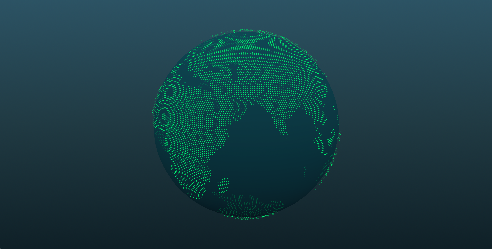

# React Three.js Globe Viewer

This is a boilerplate for creating a 3D globe using three.js within a React environment.

This project was initialized using [threejs-globe](https://github.com/jessehhydee/threejs-globe?tab=readme-ov-file).

## Description

I integrated modified JavaScript code into a React component to make it compatible with React.

Only three files (App.js, App.css, globe.js) were fixed after creating a new React app.

React Hooks such as useEffect and useRef were utilized for this integration.

## Performance

In my experience, using three.js within React doesn't perform well as vanilla JS implementations.

While I haven't measured rendering speeds empirically, the performance is noticeably slower on the Chrome browser.

If you're considering my project as a reference, please be aware that there might be some issues in my code affecting performance.

For projects where performance is critical, I recommend using `React Three Fiber` instead.

## Available Scripts

Don't forget to run `npm install` first!

In the project directory, you can run:

### `npm start`

Runs the app in the development mode.\
Open [http://localhost:3000](http://localhost:3000) to view it in your browser.

The page will reload when you make changes.\
You may also see any lint errors in the console.

### `npm run build`

Builds the app for production to the `build` folder.\
It correctly bundles React in production mode and optimizes the build for the best performance.

The build is minified and the filenames include the hashes.\
Your app is ready to be deployed!

See the section about [deployment](https://facebook.github.io/create-react-app/docs/deployment) for more information.
